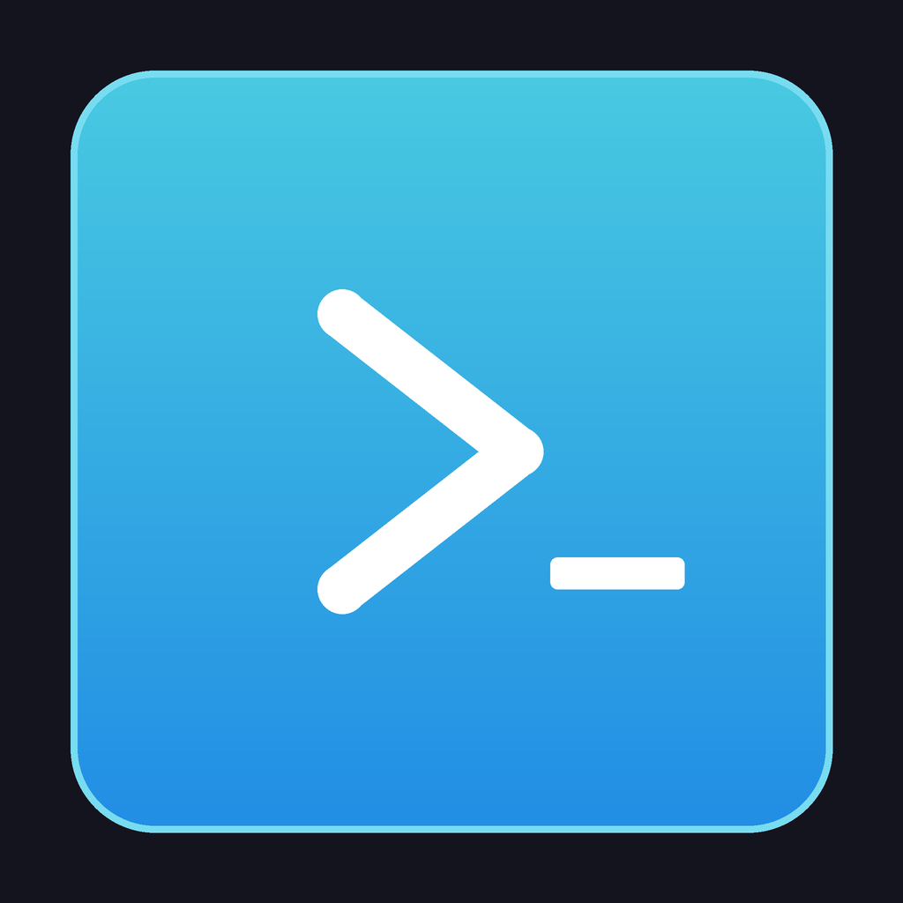

# Cosmos Terminal

A high-performance terminal emulator built with [Tauri v2](https://v2.tauri.app/) and [xterm.js](https://xtermjs.org/).



## Features

- **Multi-project workspaces** — Organize terminal sessions by project with a tab bar
- **Split panes** — Horizontal and vertical splits with keyboard navigation
- **Multiple sessions** — Tabbed sessions within each project
- **Git integration** — Built-in sidebar for staging, diffing, and committing with optional AI-generated commit messages (OpenAI)
- **Configurable keybindings** — Customizable shortcuts for splits, pane navigation, and session cycling
- **Settings panel** — Font, theme, cursor style, scrollback, and shell configuration
- **System monitor** — CPU and memory usage in the status bar
- **WebGL rendering** — GPU-accelerated terminal rendering via xterm.js addon
- **Workspace persistence** — Restores your projects, sessions, and layout on restart

## Prerequisites

- [Node.js](https://nodejs.org/) (v18+)
- [Rust](https://www.rust-lang.org/tools/install) (stable)
- [Tauri v2 prerequisites](https://v2.tauri.app/start/prerequisites/) for your platform

## Getting Started

```bash
# Install frontend dependencies
npm install

# Run in development mode
npm run tauri dev

# Build for production
npm run tauri build
```

## Project Structure

```
src/                  # Frontend (TypeScript + xterm.js)
  components/         # UI components (tabs, settings, git sidebar, etc.)
  services/           # PTY, settings, git, logging services
  state/              # Centralized state management
  styles/             # CSS stylesheets
  utils/              # Keybindings, DOM helpers, utilities
  layout/             # Pane tree layout logic

src-tauri/            # Backend (Rust + Tauri)
  src/
    commands/          # Tauri IPC command handlers
    pty/               # PTY session management
```

## Default Keybindings

| Action | Shortcut |
|--------|----------|
| New session | `Ctrl+Shift+T` |
| Close session | `Ctrl+Shift+W` |
| Settings | `Ctrl+,` |
| Git sidebar | `Ctrl+Shift+G` |
| Split down/up/left/right | Configurable in settings |
| Navigate panes | Configurable in settings |
| Cycle sessions/projects | Configurable in settings |

## License

[MIT](LICENSE)
