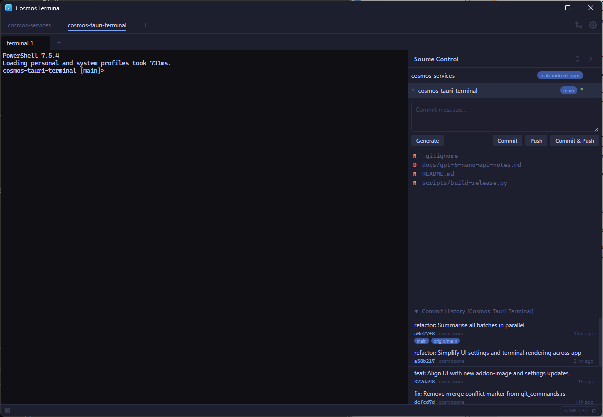

# Cosmos Terminal

**A terminal built for coding on Windows.** Project-level workspace organization, split panes, and a built-in Git sidebar — so you can write, navigate, and commit without ever leaving the terminal.

Built with [Tauri v2](https://v2.tauri.app/) + Rust. Developed and tested on Windows 11.



---

## The Problem

Developers on Windows don't have many great options. Windows Terminal is fast but it's just a shell — no project awareness, no source control. VS Code has an integrated terminal but you're running an entire IDE just to use a terminal with Git. Tabby and Hyper are Electron-based, cross-platform afterthoughts that don't feel native on Windows.

**Cosmos Terminal fills the gap**: a lightweight Windows terminal that understands your coding workflow.

## What Makes It Different

### Project-Level Organization

Most terminals give you a flat list of tabs. That breaks down when you're working across multiple codebases. Cosmos Terminal organizes terminals in two levels — **projects** at the top, **sessions** within each project:

```
cosmos-api          ← project tab
  ├── terminal 1    →  dev server
  ├── terminal 2    →  database
  └── terminal 3    →  tests

cosmos-frontend     ← project tab
  ├── terminal 1    →  vite dev
  └── terminal 2    →  playwright
```

Switch projects with one click. Each project keeps its own terminals, split layouts, and working directory — all persisted across restarts.

### Built-in Git Sidebar

Stage files, review diffs, write commit messages, and push — right next to your terminal. No context switching to another app. Toggle it with `Ctrl+Shift+G`.

Optionally generate conventional commit messages with AI (OpenAI) for large changesets.

### Built and Tested on Windows 11

This isn't a Linux terminal ported to Windows. Cosmos Terminal is developed and tested on Windows 11 from day one:

- **ConPTY** backend — works with PowerShell, CMD, Git Bash, and other Windows shells
- **WebGL rendering** with ClearType LCD text optimizations
- **Windows 11 dark mode** title bar integration
- **Tauri v2 + Rust** backend — uses the system WebView2 already on Windows 11, no bundled browser

### How It Compares

| | Windows Terminal | Tabby | Hyper | **Cosmos Terminal** |
|---|:---:|:---:|:---:|:---:|
| Split panes | Yes | Yes | No | **Yes** |
| Tabs | Yes | Yes | Yes | **Yes** |
| **Project-level grouping** | No | No | No | **Yes** |
| **Sessions per project** | No | No | No | **Yes** |
| **Built-in Git sidebar** | No | No | No | **Yes** |
| **AI commit messages** | No | No | No | **Yes** |
| **Commit history** | No | No | No | **Yes** |
| Workspace persistence | No | Partial | No | **Yes** |
| Rendering | DirectX | WebGL (Electron) | DOM (Electron) | **WebGL (WebView2)** |
| Runtime | Native C++ | Electron (~200MB) | Electron (~150MB) | **Tauri + Rust** |

---

## Features

- **Multi-project workspaces** — Top-level project tabs, each with its own terminals and layout
- **Sessions per project** — Tabbed sessions within each project, each with independent split panes
- **Split panes** — Horizontal and vertical splits with keyboard navigation
- **Git sidebar** — Stage, diff, commit, push, and browse commit history from a collapsible panel
- **AI commit messages** — Generate conventional commit messages from staged changes (OpenAI, optional)
- **WebGL rendering** — GPU-accelerated terminal via xterm.js WebGL addon with ClearType optimizations
- **Workspace persistence** — Projects, sessions, splits, and sidebar state restored on restart
- **Configurable keybindings** — Customize shortcuts for splits, navigation, and session cycling
- **System monitor** — CPU and memory usage in the status bar
- **Lightweight** — Tauri v2 + Rust backend, small install footprint

## Getting Started

### Prerequisites

- [Node.js](https://nodejs.org/) (v18+)
- [Rust](https://www.rust-lang.org/tools/install) (stable)
- [Tauri v2 prerequisites](https://v2.tauri.app/start/prerequisites/)

### Build and Run

```bash
npm install
npm run tauri dev
```

### Build for Production

```bash
npm run tauri build
```

The installer will be in `src-tauri/target/release/bundle/`.

## Keybindings

| Action | Shortcut |
|--------|----------|
| New session | `Ctrl+Shift+T` |
| Close session | `Ctrl+Shift+W` |
| Settings | `Ctrl+,` |
| Git sidebar | `Ctrl+Shift+G` / `Alt+D` |
| Split panes | Configurable in settings |
| Navigate panes | Configurable in settings |
| Cycle sessions/projects | Configurable in settings |

## Project Structure

```
src/                  # Frontend (TypeScript + xterm.js)
  components/         # UI components (tabs, settings, git sidebar)
  services/           # PTY, settings, git, system monitor
  state/              # Centralized state management
  layout/             # Pane tree and split layout logic

src-tauri/            # Backend (Rust + Tauri v2)
  src/commands/       # Tauri IPC handlers (git, PTY, system)
  src/pty/            # PTY session management (ConPTY)
```

## License

[MIT](LICENSE)
