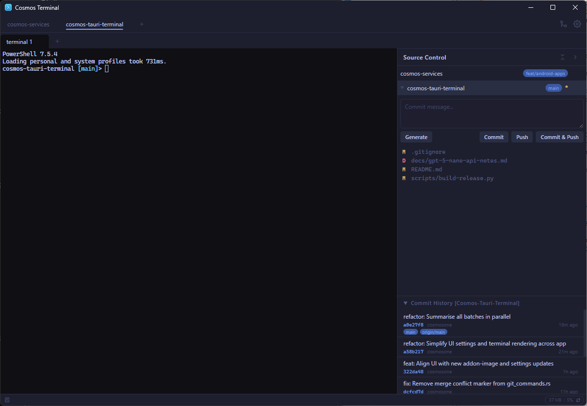

# Cosmos Terminal

**A terminal built for vibe coding on Windows.** Project workspaces, split panes, an embedded browser, AI agent sessions, a file browser, and Git — all in one window. No IDE required.

Built with [Tauri v2](https://v2.tauri.app/) + Rust. Developed and tested on Windows 11.



---

## Why Cosmos Terminal

Windows Terminal is fast but it's just a shell — no project awareness, no source control, no file browsing. VS Code has all of that, but you're running an entire IDE. Electron-based terminals like Tabby and Hyper are cross-platform afterthoughts that don't feel native on Windows.

Cosmos Terminal fills the gap: a lightweight, native Windows terminal that understands your coding workflow. It's particularly well suited for **vibe coding** — working with AI agents like Claude, Codex, and Gemini directly in your terminal while keeping your files, browser, and Git all within reach.

## What Makes It Different

### Project-Level Organisation

Most terminals give you a flat list of tabs. That breaks down when you're working across multiple codebases. Cosmos Terminal organises terminals in two levels — **projects** at the top, **work tabs** within each project:

```
cosmos-api          ← project tab
  ├── terminal 1    →  dev server
  ├── terminal 2    →  database
  ├── config.yaml   →  file tab (built-in editor)
  └── localhost:3000 →  browser tab (embedded)

cosmos-frontend     ← project tab
  ├── Claude        →  AI agent session
  ├── terminal 1    →  vite dev
  └── terminal 2    →  tests
```

Switch projects with one click. Each project keeps its own terminals, file tabs, browser tabs, split layouts, and working directory — all persisted across restarts.

### AI Agent Sessions

Launch AI coding agents directly from the terminal. Built-in support for **Claude**, **Codex**, **Gemini**, and **Open Code** — select an agent from the dropdown when creating a new session and it starts automatically with the right command.

Agent sessions appear as regular work tabs with their own icons, so you can run an AI agent alongside your dev server and tests in the same project.

### Embedded Browser

Open web pages in tabs alongside your terminals — no Alt-Tab to Chrome. Built on WebView2 (the same engine behind Edge, already on Windows 11).

- Address bar with URL entry and DuckDuckGo search fallback
- Back, forward, reload, and zoom controls (`Ctrl++`/`Ctrl+-`/`Ctrl+0`)
- LRU-based tab pooling — keeps memory bounded while preserving page state
- Browser tabs persist across restarts like everything else

Useful for keeping docs, localhost, or a PR review open right next to the terminal that's running the code.

### Built-in Git Sidebar

Stage files, review diffs, write commit messages, and push — right next to your terminal. Toggle with `Alt+D`. Projects with no changes stay compact to reduce visual noise.

Commit history with a graph view lets you browse past commits without switching to another tool.

Optionally generate conventional commit messages with AI (OpenAI `gpt-5-nano`) for large changesets — configure your API key in settings.

### File Browser & Editor

Toggle with `Alt+F` to get a tree view of the active project's directory.

- **Open any file** as a tab — text files are editable, Markdown renders with formatting (toggle between view and edit)
- **Find in document** — `Ctrl+F` for case-insensitive search with match highlighting and navigation
- **Real-time sync** — file tabs detect external changes via filesystem watcher events and auto-refresh
- **Conflict-safe saves** — if a file changed on disk since you opened it, you choose whether to reload or overwrite
- **Search files** — `Ctrl+Shift+F` to search the file tree by name
- **Context actions** — right-click for delete, show in Explorer, and more
- Sidebar is resizable (200–500px) and width persists

### Split Panes

Horizontal and vertical splits within any terminal session. Keyboard shortcuts for splitting (`Alt+X/S/Z/C`) and navigating between panes (`Alt+Arrows`). Drag dividers to resize. The split layout is a binary tree — nest splits as deep as you need.

### Tab Activity Indicators

When a background terminal has a running command, a pulsing blue dot appears on its session tab and project tab.

- Detects activity via **OSC 133 shell integration** with automatic fallback to **output volume heuristics**
- Only appears on background tabs — never on the one you're looking at
- Auto-clears when the command finishes or output stops
- Mute individual sessions to suppress their indicators

### Run Button

A configurable play button on terminal tabs that sends a command to the active pane. Set your build/test command once (e.g. `python scripts/build.py`) and trigger it with one click. Toggled via settings.

---

## Features

| Category | Features |
|----------|----------|
| **Workspaces** | Multi-project tabs, per-project sessions, workspace persistence across restarts |
| **Terminal** | Split panes (horizontal/vertical), WebGL rendering with ClearType, 10K–100K scrollback, copy-on-select, right-click paste |
| **AI Agents** | One-click launch for Claude, Codex, Gemini, Open Code with auto-configured commands |
| **Browser** | Embedded WebView2 tabs with navigation, zoom, address bar, LRU pooling |
| **Git** | Stage, diff, commit, push, commit history graph, AI commit messages (OpenAI) |
| **Files** | File browser tree, built-in editor/viewer, Markdown rendering, find in document, filesystem watcher |
| **Tabs** | Drag-to-reorder, lock (protect from close), mute (suppress indicators), rename, context menus |
| **Run** | Configurable run button on terminal tabs for quick command execution |
| **Customisation** | 22 configurable keybindings, terminal/UI/editor font settings, shell path selection |
| **System** | CPU and memory monitor in status bar, debug logging with auto-expiry, memory cleanup |

## Built for Windows

This isn't a Linux terminal ported to Windows. Every layer is Windows-native:

- **ConPTY** backend — works with PowerShell, CMD, Git Bash, NuShell, and other Windows shells
- **WebView2** — the system browser engine already on Windows 11, no bundled Chromium
- **WebGL rendering** with ClearType LCD text optimisations
- **Windows 11 dark mode** title bar integration
- **Tauri v2 + Rust** backend — small install footprint, low memory use
- **Path security** — canonicalisation and traversal prevention at every IPC boundary

---

## Getting Started

### Prerequisites

- [Node.js](https://nodejs.org/) (v18+)
- [Rust](https://www.rust-lang.org/tools/install) (stable)
- [Tauri v2 prerequisites](https://v2.tauri.app/start/prerequisites/)

### Build and Run

```bash
npm install
npm run tauri dev
```

### Build for Production

```bash
npm run tauri build
```

The installer will be in `src-tauri/target/release/bundle/`.

## Keybindings

All shortcuts are configurable in settings (`Ctrl+,`).

| Action | Default |
|--------|---------|
| New session | `Ctrl+Shift+T` |
| Close session | `Ctrl+W` |
| Settings | `Ctrl+,` |
| File browser | `Alt+F` |
| Search file browser | `Ctrl+Shift+F` |
| Git sidebar | `Alt+D` |
| Find in document | `Ctrl+F` |
| Split down / up / left / right | `Alt+X` / `Alt+S` / `Alt+Z` / `Alt+C` |
| Navigate panes | `Alt+Arrows` |
| Cycle sessions | `Alt+K` / `Alt+J` |
| Cycle projects | `Alt+I` / `Alt+U` |
| Rename tab | `Ctrl+Shift+N` |
| Scroll to bottom | `Alt+B` |

## Project Structure

```
src/                  # Frontend (TypeScript + xterm.js)
  components/         # UI components (tabs, settings, git, file browser, browser)
  services/           # PTY, settings, git, filesystem, browser, system monitor
  state/              # Centralised state management (Redux-like store)
  layout/             # Pane tree and split layout logic
  utils/              # Shared utilities (icons, paths, file types, tab drag)

src-tauri/            # Backend (Rust + Tauri v2)
  src/commands/       # Tauri IPC handlers (git, PTY, filesystem, browser, system)
  src/pty/            # PTY session management (ConPTY)
  src/browser/        # WebView2 pool and lifecycle management
  src/security/       # Path validation and input sanitisation
  src/watcher.rs      # Filesystem change detection (debounced)
```

## Tech Stack

| Layer | Technology |
|-------|-----------|
| Framework | Tauri v2 |
| Backend | Rust (tokio, parking_lot, serde) |
| Terminal | xterm.js 6 with WebGL addon |
| PTY | portable-pty (ConPTY on Windows) |
| Git | git2 (libgit2 bindings) |
| Browser | WebView2 via webview2-com |
| System stats | sysinfo |
| File watching | notify (debounced) |
| Frontend | Vanilla TypeScript, direct DOM manipulation — no React/Vue/Svelte |

## License

[MIT](LICENSE)
